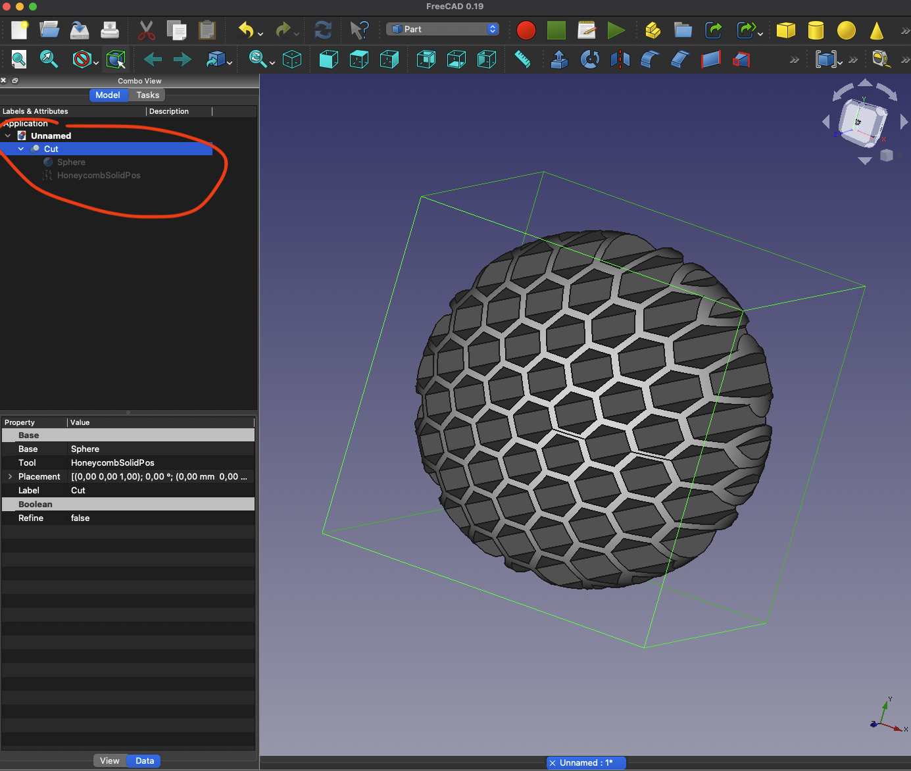

# FreeCAD-macros-HoneycombSolidPosPos (HoneycombSolidPosPos.FCMacro)

This is a [FreeCAD](https://www.freecadweb.org/) [Macro](https://wiki.freecadweb.org/Macros) to create a parametric Positive Honeycomb solid mesh

## Macro Files

[Python file for HoneycombSolidPos.FCMacro](HoneycombSolidPos.FCMacro)
[Python file for honeycomb_solid_pos/honeycomb_solid_pos.py](honeycomb_solid_pos/honeycomb_solid_pos.py)

## Manually Install

copy the file and folder:

1. [HoneycombSolidPos.FCMacro](HoneycombSolidPos.FCMacro)
2. [honeycomb_solid_pos](honeycomb_solid_pos)

into your [FreeCAD macro place](https://wiki.freecadweb.org/How_to_install_macros)

`Edit → Preferences → General → Macro → Macro recording settings`

* **Linux:** usually /home/username/.FreeCAD/
* **Windows:** usually C:\Users\username\AppData\Roaming\FreeCAD\
* **MacOS:** usually /Users/username/Library/Preferences/FreeCAD/

**MacOS Example:**

## Sample Images

## License

This module is released under the GNU Library General Public License version 2:

* [https://opensource.org/licenses/LGPL-2.0](https://opensource.org/licenses/LGPL-2.0)

## Author Information

* [Christian González Di Antonio](https://github.com/christiangda)